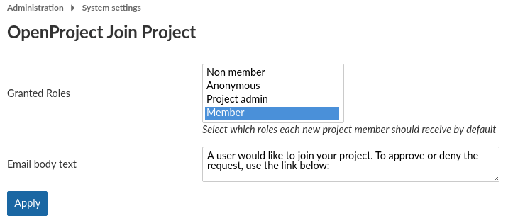
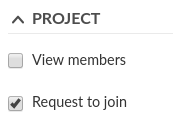
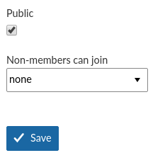

<!-- copyright
OpenProject Join Project Plugin

Copyright (C) 2019 Darryl Pogue
Copyright (C) 2012 Splendeo Innovación
Copyright (C) 2010 Eric Davis, Little Stream Software

This program is free software; you can redistribute it and/or
modify it under the terms of the GNU General Public License
as published by the Free Software Foundation; either version 2
of the License, or (at your option) any later version.

This program is distributed in the hope that it will be useful,
but WITHOUT ANY WARRANTY; without even the implied warranty of
MERCHANTABILITY or FITNESS FOR A PARTICULAR PURPOSE.  See the
GNU General Public License for more details.

You should have received a copy of the GNU General Public License
along with this program; if not, write to the Free Software
Foundation, Inc., 51 Franklin Street, Fifth Floor, Boston, MA  02110-1301, USA.
-->

OpenProject Join Project Plugin
===============================

An OpenProject plugin to allow non-members to join a project.


Features
--------

* Allow non-members to join a project themselves:
  * Can add themselves directly to a self-subscribe project
  * TODO: ~~Can send a Request to Join to other projects~~
* TODO: ~~Email notifications of requests to join~~
* TODO: ~~A simple workflow to allow project owners to approve or deny requests~~


Getting the Plugin
------------------

A copy of the plugin can be downloaded from [RubyGems](https://rubygems.org/gems/openproject-join_project) or from [GitHub](https://github.com/dpogue/openproject-join_project).


Installation and Setup
----------------------

1. Create or edit `Gemfile.plugins` in your OpenProject installation.

2. Add the following line:
  
  ```ruby
  gem 'openproject-join_project'
  ```

3. Run `bundle install`

4. Run `./bin/rails db:migrate` to install the migrations.  
   If you're running this on a production instance, remember to set `RAILS_ENV=production`.


### Global Configuration

1. Go to the OpenProject Administration Plugins page, and click "Configure" beside OpenProject Join Project Plugin.

2. Set the role that members should be granted when they join a project.

  

### Permissions

1. Go to the OpenProject Administration Permissions page.

2. Edit the *non-member* permissions, and grant them the ability to "Request to Join" a project.

  

<!--

3. Edit the Project Admin permissions, and grant them the ability to "Approve Join requests".

-->

### Project Settings

1. Go to the Project Settings page for a project.

2. On the Information tab, set whether users are allowed to request to join.

  

  * **None:** Users must be added to the project by a project admin *(default behaviour)*
  * **Self-Subscribing:** Users can click a button to join a project
  * TODO: ~~**Request to Join:** Users can click a button to request to join a project, and then that request can be approved or denied~~

Contributing
------------

Contributions of bug reports, feature requests, and pull requests are greatly appreciated!

Please note that this project is released with a [Contributor Code of Conduct](https://github.com/dpogue/openproject-join_project/blob/master/CODE_OF_CONDUCT.md). By participating in this project you agree to abide by its terms.


Licence
-------

This plugin is licensed under the GNU GPL v2 Licence.

This plugin is based on the work of [Eric Davis](https://www.littlestreamsoftware.com/) and his [Redmine Join Project](https://github.com/edavis10/redmine_join_project) plugin.  
This plugin also includes compatibility upgrades made to Eric's plugin by [Splendeo Innovación](https://github.com/splendeo/redmine_simple_join_project).
